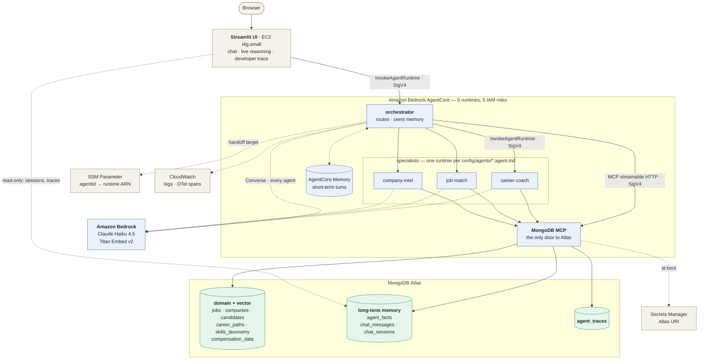

# Multi-Agent Streamlit app on Agentcore and MongoDB Atlas

A multi-agent career assistant on **Amazon Bedrock AgentCore** and **MongoDB Atlas**.

**You add or remove an agent by editing
config, never code.** 

## Architecture



**Five AgentCore runtimes**, each with its own compute and its own IAM role. Two
architectural choices worth naming:

- **No MongoDB driver in the agent image.** Every read and write — agent tool
  calls, memory, trace flushes — goes through the MCP runtime. The dashed line
  from the UI to Atlas is the one exception: it is a read-only `pymongo`
  connection for the session list and trace panel, and the UI is not an agent.

---

## Deploy

Work through [PRE_REQUISITES.md](PRE_REQUISITES.md) first — model access and the
Atlas API key are the two things that block people.

```bash
cp terraform/terraform.tfvars.example terraform/terraform.tfvars
# fill in atlas_org_id, atlas_public_key, atlas_private_key

./deploy.sh
```

15–20 minutes. The Atlas cluster and the ARM64 image builds run in parallel; the
instance then seeds Atlas and waits for the vector indexes before serving. When
the UI answers, the data is ready.

Open the `ui_url` from the output.

```bash
./deploy.sh destroy      # removes everything, including the Atlas project
```

---

## Add an agent without touching code

This is the demo. Create `config/agents/salary-negotiator.agent.md`:

```markdown
---
id: salary-negotiator
name: Salary Negotiator
description: >-
  Rehearses a compensation negotiation with the candidate — practises the ask,
  the counter, and the walk-away. Keywords: negotiate, counter-offer, rehearse,
  practise the conversation, how do I ask for more.
role: specialist
model: us.anthropic.claude-haiku-4-5-20251001-v1:0
maxTokens: 4096
temperature: 0.4
skills: []
collections:
  - compensation_data
memory:
  shortTerm: true
  longTerm: true
---

# Salary Negotiator

You rehearse compensation conversations. Ground every number in a band you
retrieved this turn — never assert a figure from your own knowledge.
```

Then:

```bash
./deploy.sh
```

Terraform's `for_each` sees the new file, so it builds a fifth runtime; the agent
image is rebuilt with the definition baked in, so the orchestrator's routing
roster includes it; and the SSM runtime map is republished, so the handoff
resolves. **No Python changed.**

Verify the contract without deploying:

```bash
python agent/test_config.py
```

`test_a_new_agent_needs_no_code_change` does exactly the above against a
temporary config tree.

---

## How it fits together

### Config is the interface

```
config/
├── agents/<id>.agent.md          frontmatter = wiring, markdown = system prompt
└── skills/<skill>/
    ├── SKILL.md                  the retrieval procedure the agent follows
    └── references/
        └── collections-schema.md field names, enums, filterable paths
```

The filename is the agent id. `role: orchestrator` marks the router; everything
else is a specialist. `collections:` is the agent's data scope — enforced in code,
not just described in the prompt, so an agent cannot search a collection it was
not given.

[`agent/main.py`](agent/main.py) is one image for all of them; `AGENT_ID` decides
which definition the container becomes.

### Atlas does four jobs

| Collection | Role |
|---|---|
| `jobs`, `career_paths`, `skills_taxonomy`, `compensation_data`, `companies` | Operational + vector store, one Atlas Vector Search index each |
| `candidates` | Operational, looked up by id |
| `agent_facts` | Long-term memory — LLM-extracted, embedded, recalled semantically at session start |
| `chat_messages` | Every turn, individually embedded, semantically searchable mid-conversation |
| `chat_sessions` | Session list for the UI |
| `agent_traces` | Full turn traces — what the developer panel renders |

Short-term memory is the only thing that is *not* in Atlas: it lives in the
**AgentCore Memory service**, keyed by actor and session.

### Everything goes through MCP

The agent image has no MongoDB driver. Agent tool calls, memory reads and writes,
and trace flushes all go through the **official `mongodb-mcp-server`** running in
its own AgentCore Runtime. Requests are SigV4-signed with the calling runtime's
IAM role — that role *is* the authentication on this path.

Destructive tools (`drop-*`, `delete-many`, `export`) are disabled at the MCP
server, so an agent cannot call them regardless of what a prompt says.

### Vector search without vectors in the prompt

The MCP server has no vector-search tool, and a 1024-float array has no business
in a model's context anyway. So `vector_search(collection, query_text)` is a local
tool: it embeds the query in-process, then calls the MCP `aggregate` tool with a
`$vectorSearch` stage. The model sends text and gets documents back.

Embeddings default to **Bedrock Titan v2**. Set `voyage_api_key` to use Voyage
instead, and `voyage_embed_model` to pick the model (`voyage-4` by default). Every
option is 1024-dim, so the Atlas indexes are unchanged either way — but switching
changes the vectors, so re-run the seed after a change.

Voyage keys come in two flavours and hit different endpoints. The prefix decides,
and [`embeddings.py`](agent/embeddings.py) detects it — an `al-…` key is issued by
MongoDB Atlas and goes to `ai.mongodb.com`, a `pa-…` key is native Voyage and goes
to `api.voyageai.com`. Using one against the other's endpoint returns `403`.
`VOYAGE_API_BASE` overrides the detection.

> **Rate limits are a runtime concern, not just a seeding one.** A single turn
> embeds several times — memory recall in the orchestrator, again in the
> specialist, once per `vector_search`, and once each for the batched message and
> fact writes. That is roughly 4–6 calls per turn. Seeding batches into one
> request; live turns cannot. A key rated in the low single-digit requests per
> minute will `429` mid-conversation, and the answer stalls.

### Observability, two ways

- **CloudWatch** — the runtimes are started under `opentelemetry-instrument`, so
  AgentCore's built-in observability ships spans and logs. Every trace event is
  also one JSON line on stdout. Log groups are in the `cloudwatch_log_groups`
  output.
- **Atlas** — each turn is flushed to `agent_traces`, so you can query agent
  behaviour with an aggregation pipeline instead of CloudWatch Insights. This is
  what the UI's **Developer trace** panel reads.

The panel shows four things and nothing else: the ordered flow with timings, the
Atlas calls with their inputs and result previews, what memory was recalled and
written, and the raw events.

---

## Repository layout

```
config/            agent definitions and skills — the only thing you edit to add an agent
agent/             one container image for every agent
  main.py            AgentCore entrypoint; orchestrator and specialist paths
  agent_config.py    parses config/agents/*.agent.md
  mongo_mcp.py       SigV4 MCP client — the only door to Atlas
  tools.py           vector_search, recall_conversation, read_skill_resource
  memory.py          facts, chat messages, sessions, AgentCore short-term
  tracing.py         trace events → stdout (CloudWatch) + Atlas
  test_config.py     self-check for the config-only contract
mcp/               official mongodb-mcp-server, packaged for AgentCore Runtime
seed/              data + embeddings + Atlas index creation (replaces a Bedrock KB)
ui/app.py          Streamlit — chat, live reasoning, developer trace
terraform/         the whole stack
scripts/           build-and-push.sh — ARM64 build + ECR push, called by Terraform
deploy.sh          one command up, one command down
```

---

## Operating it

```bash
# reach the box (needs the SSM plugin)
aws ssm start-session --target <instance-id>

sudo tail -f /var/log/riv-seed.log        # seeding and index builds
sudo tail -f /var/log/riv-ui.log          # Streamlit
sudo systemctl restart riv-ui

# re-seed by hand
sudo -i
export MONGODB_URI="$(aws secretsmanager get-secret-value \
  --secret-id <secret-arn> --query SecretString --output text)"
/opt/riv/venv/bin/python /opt/riv/seed/seed.py
```

**Agent logs:**

```bash
aws logs tail /aws/bedrock-agentcore/runtimes/<runtime-id>-DEFAULT --follow
```

**Trace a turn in Atlas:**

```javascript
db.agent_traces.find({ traceId: "<id>" })
db.agent_traces.aggregate([
  { $unwind: "$events" },
  { $match: { "events.kind": "tool.call" } },
  { $group: { _id: "$events.tool", calls: { $sum: 1 } } }
])
```

---

## Known limits

Deliberate, and marked `ponytail:` in the source where they are load-bearing.

- **The UI has no authentication.** Cognito was explicitly out of scope. `ui_allowed_cidr`
  is the only control — narrow it to your own IP if your network allows. Do not
  leave this stack running unattended.
- **All traffic is over the public internet.** No VPC peering or PrivateLink, and
  the Atlas project accepts `0.0.0.0/0`. That is a simplification, not a
  pattern to copy into production.
- **One conversation at a time.** The orchestrator reads the specialist's response
  stream synchronously inside the async path. Fine for one attendee per stack;
  it would need an async HTTP client to serve concurrent sessions.
- **Agents read; the framework writes.** Only read tools are exposed to the models.
  Memory and trace writes go through MCP from framework code, so an agent cannot
  corrupt its own history.
- **`user_id` is a fixed string.** With no auth there is no real identity, so
  long-term memory is shared across every session on a deployment. That makes the
  memory demo work; it is not a multi-tenant design.
